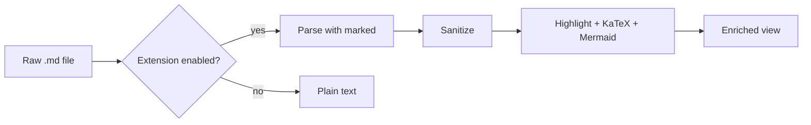
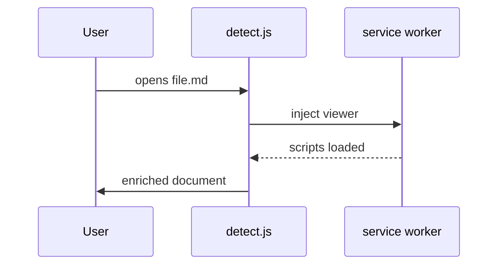

# Markdown Kitchen Sink

A single document that exercises every block and inline construct the viewer
claims to support. If something here looks wrong, the renderer is wrong.

## Inline formatting

Regular text with **bold**, *italic*, ***bold italic***, ~~strikethrough~~,
`inline code`, <mark>highlighted</mark>, H<sub>2</sub>O, E=mc<sup>2</sup>, and a
[link to the spec](https://commonmark.org). An autolink: https://example.com.
A footnote reference sits here[^one] and another one here[^two].

Line one of a hard-wrapped paragraph
continues on line two without a break.

## Headings

### Third level

#### Fourth level

##### Fifth level

###### Sixth level

## Lists

- Unordered item
- Item with nested list
  - Nested one
  - Nested two
    - Deeply nested
- Item with a paragraph

  Continuation paragraph inside the list item.

1. Ordered first
2. Ordered second
   1. Nested ordered
   2. Another
3. Ordered third

### Task list

- [x] Ship the parser
- [x] Wire up syntax highlighting
- [ ] Write the README
- [ ] Publish to the Web Store

### Definition-ish list

Term one
: not native markdown, shown as plain text

## Blockquotes and alerts

> A plain blockquote. It should read as a quotation, set apart but not shouty.
>
> — Someone quotable

> [!NOTE]
> Useful information that users should know, even when skimming.

> [!TIP]
> Helpful advice for doing things better or more easily.

> [!IMPORTANT]
> Key information users need to know to achieve their goal.

> [!WARNING]
> Urgent info that needs immediate user attention to avoid problems.

> [!CAUTION]
> Advises about risks or negative outcomes of certain actions.

## Code

Inline `const x = 1` and a fenced block with a language:

```javascript
// Debounce a function, preserving `this` and the last arguments.
export function debounce(fn, wait = 200) {
  let timer = null;
  return function debounced(...args) {
    clearTimeout(timer);
    timer = setTimeout(() => fn.apply(this, args), wait);
  };
}
```

```python
from dataclasses import dataclass

@dataclass(frozen=True)
class Point:
    x: float
    y: float

    def distance_to(self, other: "Point") -> float:
        return ((self.x - other.x) ** 2 + (self.y - other.y) ** 2) ** 0.5
```

```bash
# Find large files, newest first
find . -type f -size +10M -print0 | xargs -0 ls -lhS | head -20
```

```json
{
  "name": "markdown-viewer",
  "version": "1.0.0",
  "keywords": ["markdown", "chrome-extension"],
  "private": true
}
```

```
A fence with no language tag at all.
It should still render as a code block.
```

```diff
- const old = require('legacy');
+ import { modern } from 'modern';
```

## Tables

| Feature           | Status | Notes                              |
| ----------------- | :----: | ---------------------------------- |
| GFM tables        |   ✅   | With alignment                     |
| Syntax highlight  |   ✅   | 40+ languages via highlight.js     |
| Math              |   ✅   | KaTeX, inline and display          |
| Diagrams          |   ✅   | Mermaid, loaded lazily             |
| Footnotes         |   ✅   | Numbered, with back-references     |

| Left | Center | Right |
| :--- | :----: | ----: |
| a    |   b    |     1 |
| cc   |   dd   |    22 |

## Math

Inline math such as $e^{i\pi} + 1 = 0$ should flow with the text, and the cost
is $O(n \log n)$ for the sort. Prices like $30 and $45 must *not* be treated as
math delimiters.

Display math:

$$
\int_{-\infty}^{\infty} e^{-x^2}\,dx = \sqrt{\pi}
$$

$$
\begin{aligned}
\nabla \cdot \mathbf{E} &= \frac{\rho}{\varepsilon_0} \\
\nabla \cdot \mathbf{B} &= 0 \\
\nabla \times \mathbf{E} &= -\frac{\partial \mathbf{B}}{\partial t}
\end{aligned}
$$

Math inside code must stay literal: `$x^2$` and

```
$$ this is not math $$
```

## Diagrams





## Images


A broken image reference: 

## Horizontal rule

---

## HTML passthrough

<div align="center">
  <strong>Centered HTML block</strong><br />
  <em>Sanitized, but preserved.</em>
</div>

Dangerous HTML must be stripped: <script>alert('xss')</script> and
.

## Long content for scroll spy

Sed ut perspiciatis unde omnis iste natus error sit voluptatem accusantium
doloremque laudantium, totam rem aperiam, eaque ipsa quae ab illo inventore
veritatis et quasi architecto beatae vitae dicta sunt explicabo.

### Subsection A

Nemo enim ipsam voluptatem quia voluptas sit aspernatur aut odit aut fugit, sed
quia consequuntur magni dolores eos qui ratione voluptatem sequi nesciunt.

### Subsection B

Neque porro quisquam est, qui dolorem ipsum quia dolor sit amet, consectetur,
adipisci velit, sed quia non numquam eius modi tempora incidunt ut labore et
dolore magnam aliquam quaerat voluptatem.

[^one]: The first footnote. It supports **inline formatting** and `code`.
[^two]: The second footnote, with a [link](https://example.com) inside it.
